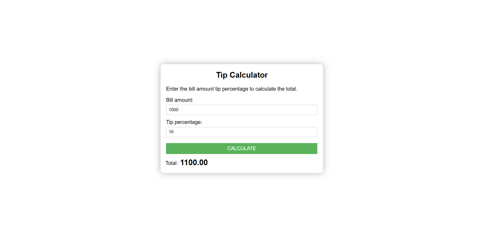

---

# 💰 Tip Calculator

## 📌 Project Overview

In this project, our aim is to build a **modern Tip Calculator**. It helps users quickly calculate the total bill including the tip, based on the bill amount and tip percentage provided.

## ✨ Features

* 🧾 Input for **Bill Amount**
* 💯 Input for **Tip Percentage**
* 🔄 Real-time **total calculation** based on the values entered
* 🎨 Clean and **modern UI** designed with **CSS**

## 🧠 What You'll Learn

* 📍 How to capture input values using **JavaScript**
* 📍 How to perform calculations based on user input
* 📍 How to dynamically update the UI with the results
* 📍 How to style user interfaces using **modern CSS techniques**

## 🛠️ Technologies Used

* **HTML** – to create the structure
* **CSS** – to design a responsive and elegant user interface
* **JavaScript** – to calculate the tip and total amount dynamically

## 🖼️ Screenshot




## 🧮 How It Works

1. User enters the **bill amount**.
2. User enters the **tip percentage**.
3. JavaScript captures both values and calculates:

   ```
   Tip = (Bill Amount × Tip %) / 100  
   Total = Bill Amount + Tip
   ```
4. The **total amount** is displayed instantly.

## ✅ Summary

This beginner-friendly project will help you learn:

* **DOM manipulation**
* **Input handling**
* **Basic arithmetic in JavaScript**
* **Styling with CSS**

It's a great way to practice building interactive, user-friendly applications with **real-world value**.

---
